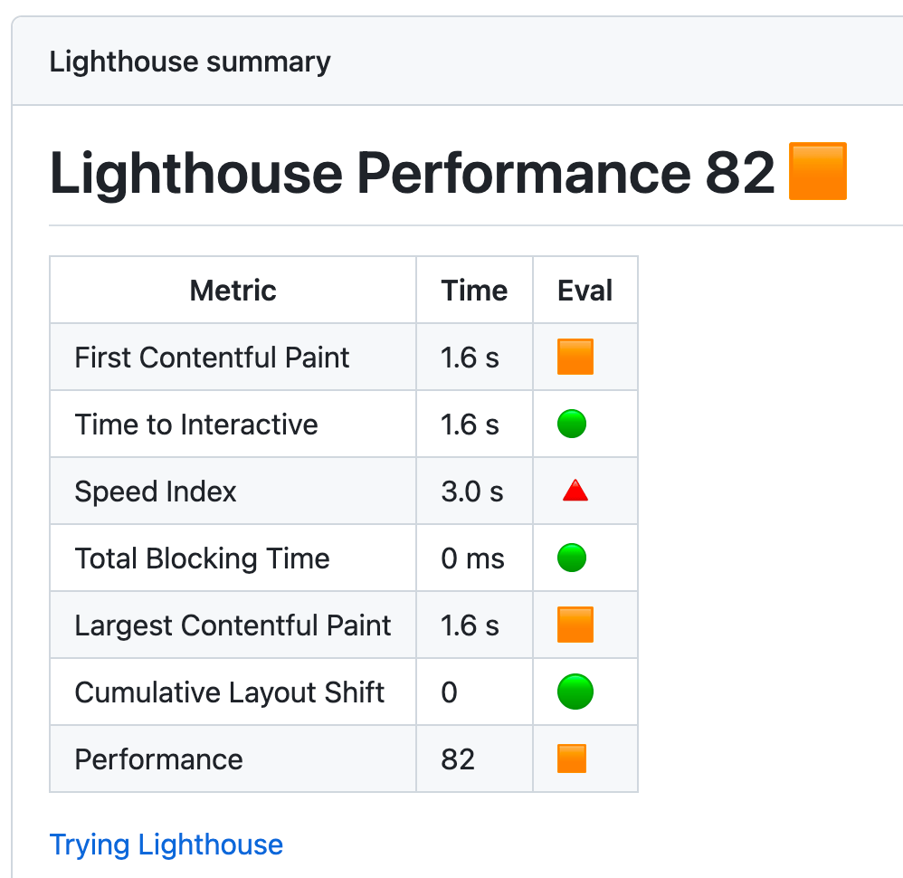
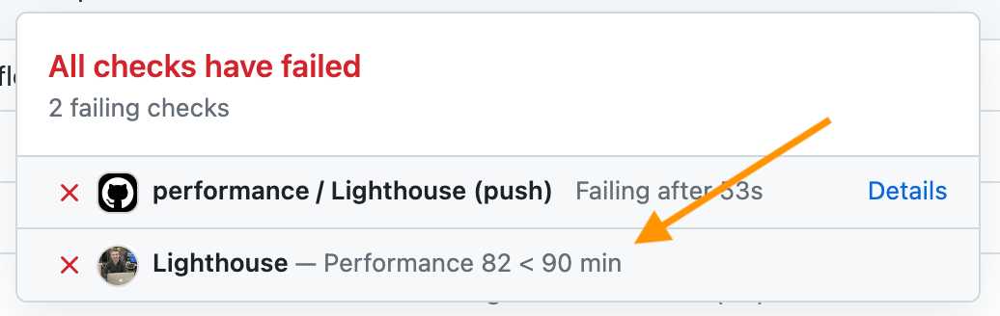
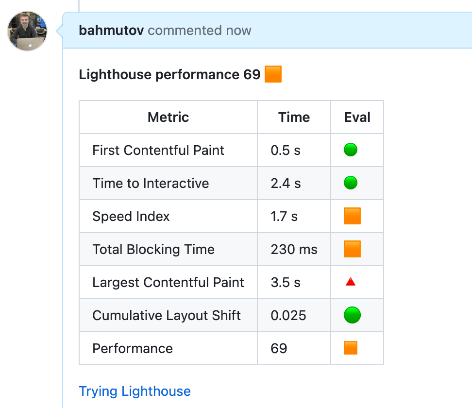

# lhci-gha

> Lighthouse CI results reporting GitHub Action

📝 Read the blog post [Trying Lighthouse](https://glebbahmutov.com/blog/trying-lighthouse/).

## Install

Add this module as a dev dependency

```
# install using NPM
$ npm i -D lhci-gha
# install using Yarn
$ yarn add -D lhci-gha
```

## Scripts

This module provides 2 command line scripts. You should use these scripts _after_ running Lighthouse CI

```yml
# https://github.com/GoogleChrome/lighthouse-ci
- name: run Lighthouse CI
  run: |
    npm install -g @lhci/cli@0.11.x
    lhci collect
# post performance summary and set the commit status
# https://github.com/bahmutov/lhci-gha
- name: Post performance summary 📊
  run: npx post-summary --report-filename lighthouse-results.json
```

### post-summary

Reads the Lighthouse JSON report and writes GitHub Lighthouse job summary



- `--report-filename` Lighthouse performance JSON filename
- `--title` summary table title

### post-status

Reads the Lighthouse JSON report and sets the GitHub Commit status



- `--report-filename` Lighthouse performance JSON filename
- `--owner` GitHub repo owner, like `bahmutov
- `--repo` GitHub repo name, like `web-performance-example`
- `--commit` Commit to set the status on
- `--target-url` Link to add to the commit status, usually to the job

Usually for pull requests, you would use the head commit SHA

```yml
- name: Post performance commit status ✅
  run: |
    npx post-status --min 90 \
      --report-filename lighthouse-results.json \
      --owner bahmutov --repo web-performance-example \
      --commit ${{ github.event.pull_request.head.sha || github.sha }} \
      --target-url "${{ github.server_url }}/${{ github.repository }}/actions/runs/${{ github.run_id }}"
  env:
    PERSONAL_GH_TOKEN: ${{ secrets.PERSONAL_GH_TOKEN }}
```

### post-comment

Posts or updates a performance comment on specific issue or pull request



- `--report-filename` Lighthouse performance JSON filename
- `--owner` GitHub repo owner, like `bahmutov
- `--repo` GitHub repo name, like `web-performance-example`
- `--issue` pull request or issue number to comment on
- `--title` the start of the comment body, like "Performance metric"

This script checks all comments on PR to find the one that starts with "\*\*${title}" text, if found it updates it. Otherwise, it posts a new comment.

```yml
- name: Post performance comment 📝
  if: github.event.pull_request
  run: |
    npx post-comment \
      --report-filename lighthouse-results.json \
      --owner bahmutov --repo web-performance-example \
      --pr ${{ github.event.pull_request.number }}
  env:
    PERSONAL_GH_TOKEN: ${{ secrets.PERSONAL_GH_TOKEN }}
```

## Examples

- [bahmutov/web-performance-example](https://github.com/bahmutov/web-performance-example)

## Debugging

This module uses [debug](https://github.com/debug-js/debug#readme) to output verbose messages. To see debug logs, run with the `DEBUG` environment variable set to `lhci-gha`

```
$ DEBUG=lhci-gha ...
```

## Small print

Author: Gleb Bahmutov &lt;gleb.bahmutov@gmail.com&gt; &copy; 2023

- [@bahmutov](https://twitter.com/bahmutov)
- [glebbahmutov.com](https://glebbahmutov.com)
- [blog](https://glebbahmutov.com/blog)
- [videos](https://www.youtube.com/glebbahmutov)
- [presentations](https://slides.com/bahmutov)
- [cypress.tips](https://cypress.tips)
- [Cypress Tips & Tricks Newsletter](https://cypresstips.substack.com/)
- [my Cypress courses](https://cypress.tips/courses)

License: MIT - do anything with the code, but don't blame me if it does not work.

Support: if you find any problems with this module, email / tweet /
[open issue](https://github.com/bahmutov/lhci-gha/issues) on Github

## MIT License

Copyright (c) 2023 Gleb Bahmutov &lt;gleb.bahmutov@gmail.com&gt;

Permission is hereby granted, free of charge, to any person
obtaining a copy of this software and associated documentation
files (the "Software"), to deal in the Software without
restriction, including without limitation the rights to use,
copy, modify, merge, publish, distribute, sublicense, and/or sell
copies of the Software, and to permit persons to whom the
Software is furnished to do so, subject to the following
conditions:

The above copyright notice and this permission notice shall be
included in all copies or substantial portions of the Software.

THE SOFTWARE IS PROVIDED "AS IS", WITHOUT WARRANTY OF ANY KIND,
EXPRESS OR IMPLIED, INCLUDING BUT NOT LIMITED TO THE WARRANTIES
OF MERCHANTABILITY, FITNESS FOR A PARTICULAR PURPOSE AND
NONINFRINGEMENT. IN NO EVENT SHALL THE AUTHORS OR COPYRIGHT
HOLDERS BE LIABLE FOR ANY CLAIM, DAMAGES OR OTHER LIABILITY,
WHETHER IN AN ACTION OF CONTRACT, TORT OR OTHERWISE, ARISING
FROM, OUT OF OR IN CONNECTION WITH THE SOFTWARE OR THE USE OR
OTHER DEALINGS IN THE SOFTWARE.
